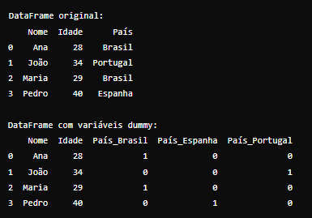

# Variáveis Dummy

- Variáveis dummy são variáveis artificiais criadas para representar informações categóricas de maneira numérica em modelos estatísticos e de machine learning. Elas são utilizadas quando temos variáveis categóricas que precisam ser incluídas em modelos matemáticos, como regressões lineares, redes neurais, entre outros, que não podem processar diretamente variáveis categóricas.

## Como funcionam?

- Representação Binária: Uma variável dummy transforma uma categoria categórica em uma ou mais variáveis binárias (0 ou 1).

### Exemplo: 

Se tivermos uma variável categórica como "País" com três categorias possíveis (Brasil, EUA, Canadá), podemos criar três variáveis dummy: 

País_Brasil, País_EUA e País_Canadá. Cada uma dessas variáveis será 1 para a categoria correspondente e 0 para as demais.

